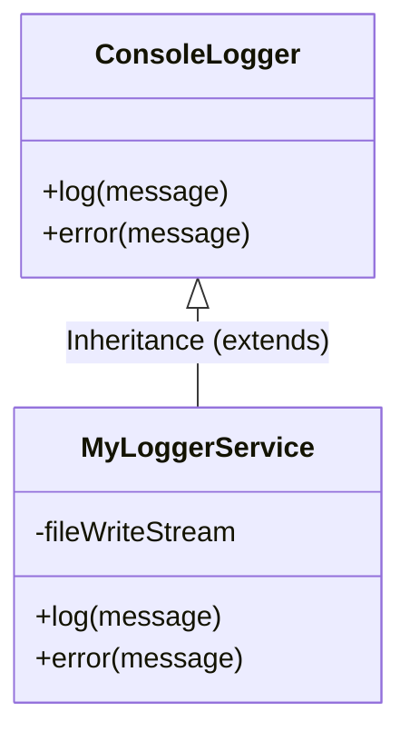
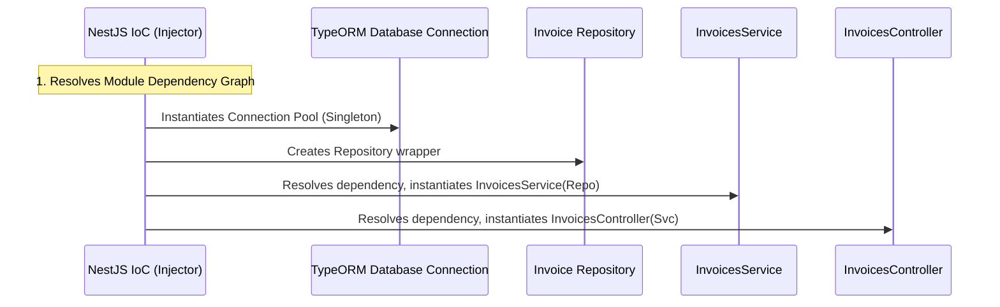

# NestJS & Enterprise System Architecture Guide
## Masterclass Engineering Guide for Technical Interviews & Core Engineering Patterns

This guide acts as your ultimate technical reference, dissecting fundamental software engineering patterns, architectural paradigms, NestJS mechanics, database strategies, and advanced systems design. 

Every single concept is mapped directly to concrete, production-grade implementations from this workspace (**Payvance Invoice Builder API**) and your accompanying **Lesson 1** codebase.

---

## 🧭 Ultimate Table of Contents
1. [🎯 OFREM Technical Interview: What to Expect & Strategic Approach](#-ofrem-technical-interview-what-to-expect--strategic-approach)
2. [💻 Core Language & OOP Foundations](#-core-language--oop-foundations)
   - Object-Oriented Programming (OOP) Pillars
   - Types & Interfaces: The DTO Paradox
3. [🏛️ Software Architecture & System Design](#️-software-architecture--system-design)
   - Monolithic vs. Hexagonal Architecture in NestJS
   - Separation of Concerns: The Data Flow Chain
4. [💉 Dependency Injection & The Injector Engine (Deep-Dive)](#-dependency-injection--the-injector-engine-deep-dive)
   - How the DI System works under the hood
   - Provider Scopes & Memory/Performance tradeoffs
   - The Resolving Mechanics (`reflect-metadata`)
5. [🏷️ Decorators & Meta-Programming](#️-decorators--meta-programming)
   - Types of Decorators in NestJS
   - Custom Decorator Construction (`@CurrentUser`, `@Roles`)
6. [🔄 HTTP REST APIs & The NestJS Request Lifecycle](#-http-rest-apis--the-nestjs-request-lifecycle)
   - REST Principles & HTTP Verbs
   - Detailed Step-by-Step Request Lifecycle Diagram
7. [🛡️ Request Processing Layers: Guards, Interceptors, & Filters](#️-request-processing-layers-guards-interceptors--filters)
   - Guards: Authentication & Authorization (`RolesGuard`, `JwtAuthGuard`)
   - Interceptors: Aspect-Oriented Response Transformation & Latency Measurement
   - Filters: Global Bulletproof Error Formatter (`AllExceptionsFilter`)
8. [🗄️ Database Architecture & Modeling Patterns](#️-database-architecture--modeling-patterns)
   - Database Basics: Relational (SQL) vs. Non-Relational (NoSQL)
   - Hybrid Modeling (SQL Schema with Nested NoSQL JSON Data)
   - Object-Relational Mapping (TypeORM vs. Prisma)
9. [⚡ Advanced Systems Engineering](#-advanced-systems-engineering)
   - JWT stateless token-based Authentication
   - High-Performance Caching Patterns (In-Memory & Redis)
   - Asynchronous Message Queues (BullMQ / Background Workers)
   - Real-time Bidirectional Comm via WebSockets (Gateways)
10. [🐳 Infrastructure, Orchestration, & Docker Basics](#-infrastructure-orchestration--docker-basics)
    - Containerization Concepts
    - Production Dockerfile & Compose Orchestration

---

## 🎯 OFREM Technical Interview: What to Expect & Strategic Approach

### 📋 Overview of the OFREM Engineering Profile
During your technical session with OFREM, the engineering panel wants to understand **how you think**, how you manage **data integrity and scale**, and how your engineering values align with their vision. 

The panel will evaluate you across four key dimensions:
```
                                ┌───────────────────────────────────────┐
                                │       OFREM Interview Pillars         │
                                └───────────────────┬───────────────────┘
                                                    │
         ┌──────────────────────────┼──────────────────────────┬──────────────────────────┐
         ▼                          ▼                          ▼                          ▼
┌──────────────────┐       ┌──────────────────┐       ┌──────────────────┐       ┌──────────────────┐
│    Technical     │       │      System      │       │     Database     │       │    Vision &      │
│    Experience    │       │   Architecture   │       │    Management    │       │     Culture      │
│  Type Safety, DI │       │ Layering, Queues │       │ ACID, JSON fields│       │ Scale, Clean Code│
└──────────────────┘       └──────────────────┘       └──────────────────┘       └──────────────────┘
```

---

### 💡 Strategic Response Matrix for OFREM

Here is exactly how to frame your answers using the **Payvance Invoice Builder API** as a case study of your engineering prowess:

| Interview Segment | What They Are Looking For | How to Answer Using This Project |
| :--- | :--- | :--- |
| **Technical Experience** | Depth in TypeScript, Type safety, framework mechanics, and clean code principles. | "I write clean, modular backends with **TypeScript** and **NestJS**, enforcing strict run-time boundaries with DTOs and decorators, ensuring compilation errors occur at build time, and utilizing Dependency Injection to decoupled testable business logic." |
| **System Architecture** | Ability to design scalable, resilient systems that handle load without failing or blocking. | "I structure applications using domain-driven architectural layers (Controllers $\rightarrow$ Services $\rightarrow$ TypeORM/Prisma $\rightarrow$ DB). I treat the Node.js event loop as sacred: I delegate CPU-intensive or slow IO tasks (like mail and PDF generation) to **background worker queues** (BullMQ/Redis), keeping the HTTP server ultra-fast and responsive." |
| **Database Management** | SQL vs. NoSQL decision-making, transactional integrity, index optimization, and data modeling. | "I believe in matching the database to the access pattern. I use **PostgreSQL** (relational) as our source of truth for transactional billing because of strict ACID requirements. However, I use **hybrid NoSQL columns** (TypeORM JSONB columns for dynamic `tax` or `discount` sub-objects) to balance relational constraints with schema flexibility." |
| **OFREM's Vision Alignment** | Interest in building next-gen scalable tools, high ownership, pragmatism, and standard-compliant deployment. | "I build with deployment in mind. I containerize applications using optimized, multi-stage **Docker** alpine builds to ensure that the exact environment on my local workspace runs seamlessly in staging and production, reducing orchestration overhead to zero." |

---

## 💻 Core Language & OOP Foundations

### Object-Oriented Programming (OOP) Pillars
NestJS leverages modern JavaScript and TypeScript classes to implement highly structured OOP concepts. OOP organizes code around logical blueprints (**Classes**) that govern state and behavior.



Your projects showcase the **4 core pillars of OOP**:

1. **Inheritance**: Subclasses inherit state and behavior from a parent class.
   * **Project Example**: [`MyLoggerService`](file:///Users/adedayo/Nest-Projects/lesson1/src/my-logger/my-logger.service.ts) inherits console capabilities from the NestJS standard logger:
     ```typescript
     export class MyLoggerService extends ConsoleLogger { ... }
     ```
2. **Polymorphism**: Changing the behavior of inherited methods (method overriding) to provide specialized functionality.
   * **Project Example**: [`MyLoggerService`](file:///Users/adedayo/Nest-Projects/lesson1/src/my-logger/my-logger.service.ts) overrides `log()`, `error()`, and `warn()` to write the logged logs to local disk files before executing the standard console behavior using `super.log()`.
3. **Encapsulation**: Restricting direct access to data structures and exposing only controlled, public APIs.
   * **Project Example**: In [`UsersService`](file:///Users/adedayo/Nest-Projects/invoice-builder-api/src/users/users.service.ts), the database repository `private readonly userRepo` is encapsulated. Outside modules or controllers cannot touch the raw SQL client or mutate records directly; they must communicate via exposed async methods like `findAll()`.
4. **Abstraction**: Hiding highly complex technical configurations behind simple, clean interfaces.
   * **Project Example**: In `DatabaseService` (or TypeORM's auto-wiring in `AppModule`), the socket pool handshake, SSL setup, and connection parameters are abstracted. The developer simply uses `@InjectRepository()` to interact with tables.

---

### Types & Interfaces: The DTO Paradox
In TypeScript, **Types** and **Interfaces** enforce structural rules on objects. However, there is a fundamental difference in how they are treated at build-time vs. run-time.

```
                  [ Compilation Boundary ]
                           │
  TypeScript Code          │       Compiled JavaScript
  ───────────────────────  │  ───────────────────────────────────
  interface User {         │  
    email: string;   ──────┼───> (COMPILATION ERASURE: Removed)
  }                        │  
                           │  
  class CreateUserDto {    │     class CreateUserDto {
    @IsEmail()             ├───>   // RUN-TIME METADATA PRESERVED!
    email: string;         │     }
  }                        │  
```

#### Why Classes are Required for DTOs (Data Transfer Objects)
> [!IMPORTANT]
> **Compilation Erasure**: TypeScript interfaces are static syntax definitions. Once compiled, they undergo complete **type erasure** and are entirely absent from the compiled JavaScript runtime.
> 
> Conversely, TypeScript **classes** are native JavaScript runtime objects that persist after compilation. NestJS relies on classes for DTOs because it needs to read runtime metadata via decorators (`@IsEmail()`, `@IsString()`) to execute request validation in global pipes (`ValidationPipe`). If you used an `interface` as a DTO, NestJS would have no structural metadata to inspect at runtime, making auto-validation impossible.

#### Types vs. Interfaces Selection Matrix
* **Use `interface`**: When defining standard contracts, public API payloads, database models, or structural shapes that might require *Declaration Merging* (e.g., adding properties to the Express Request object).
* **Use `type`**: When defining complex data unions (`InvoiceStatus = 'draft' | 'paid' | 'refunded'`), intersection types, tuples, primitive aliases, or key mappings.

---

## 🏛️ Software Architecture & System Design

### Monolithic vs. Hexagonal Architecture in NestJS
Your application is architected as a clean modular monolith that borrows structural principles from **Hexagonal Architecture (Ports and Adapters)**.

```
                 HEXAGONAL ARCHITECTURE LAYER PATTERN
                 
                 ┌────────────────────────────────┐
                 │       Presentation Layer       │ <── Adapters (Incoming HTTP)
                 │  (Controllers, WebSockets)     │
                 └───────────────┬────────────────┘
                                 │ (DTO Contracts)
                                 ▼
                 ┌────────────────────────────────┐
                 │      Business Logic Core       │ <── Ports / Core Services
                 │      (Domain Services)         │
                 └───────────────┬────────────────┘
                                 │ (Abstract Interfaces / Injection)
                                 ▼
                 ┌────────────────────────────────┐
                 │      Infrastructure Layer      │ <── Adapters (Outgoing DB / IO)
                 │    (TypeORM, BullMQ, SMTP)     │
                 └────────────────────────────────┘
```

1. **Presentation Layer**: HTTP Controllers (like [`InvoicesController`](file:///Users/adedayo/Nest-Projects/invoice-builder-api/src/invoices/invoices.controller.ts)) map inbound web requests, validate payloads via DTOs, parse route parameters, and delegate execution to the domain.
2. **Business Logic Core**: Services (like [`InvoicesService`](file:///Users/adedayo/Nest-Projects/invoice-builder-api/src/invoices/invoices.service.ts)) execute procedural logic, calculate analytics metrics, orchestrate transactions, and apply filters.
3. **Infrastructure Layer**: Outgoing integrations (TypeORM postgres engines, Mail sending drivers, PDF generators) communicate with physical resources (PostgreSQL, third-party mail APIs, local file streams).

---

### Separation of Concerns: The Data Flow Chain
By dividing your code into isolated boundaries, you prevent spaghetti code. Here is how a database query flows from the client to the database and back:

```
[ Client Request: GET /invoices?search=acme ]
      │
      ▼
[ 1. InvoicesController ] ──> Validates search params using class DTOs
      │
      ▼
[ 2. InvoicesService ] ────> Receives criteria, builds conditional query queries
      │
      ▼
[ 3. TypeORM/PostgreSQL ] ──> Runs `ILIKE` database query matching customer name/ID
      │
      ▼
[ 4. Private Formatter ] ───> Formats date strings, formats currency symbol (₦)
      │
      ▼
[ Client Response: Clean JSON payload with metadata pagination ]
```

---

## 💉 Dependency Injection & The Injector Engine (Deep-Dive)

### How the DI System Works Under the Hood
In naive software construction, classes directly instantiate their own dependencies:
```typescript
// ❌ ANTI-PATTERN: Tightly Coupled, Untestable
class InvoicesController {
  private invoicesService = new InvoicesService(); // Direct instantiation
}
```
This binds components together tightly, preventing you from mocking dependencies for automated unit tests. NestJS bypasses this limitation with a sophisticated **Dependency Injection (DI)** container operating on the **Inversion of Control (IoC)** paradigm.



#### The Exact 3-Phase Injector Engine Lifecycle
1. **Registration**: Classes annotated with `@Injectable()` are registered within a module's `providers` array. When compiled, TypeScript registers the parameter types via **`reflect-metadata`**.
2. **Analysis**: On application bootstrap, the NestJS **Injector Engine** resolves the global module graph. It recursively parses the constructors, searching for parameters, identifying each parameter's Injection Token (e.g. `InvoicesService`, `@InjectRepository(User)`).
3. **Instantiation (IoC)**: The Injector checks its internal **Singleton Instance Cache**. If the requested class dependency has not been instantiated, it recursively instantiates it, registers it in the cache, and passes it by reference to the requesting constructor.

---

### Provider Scopes: Performance vs. Memory Tradeoffs
NestJS providers are **Singletons by default**. However, NestJS supports three instantiation scopes:

| Provider Scope | Lifecycle | Memory Footprint | Ideal Use-Case |
| :--- | :--- | :--- | :--- |
| **DEFAULT (Singleton)** | **Single instance** instantiated on app startup. Shared globally across every incoming request and user session. | **Low**: Minimal garbage collection, fast runtime execution. | **Highly Recommended**. Database connections, stateless services, helper utility libraries. |
| **REQUEST** | A **brand new instance** is created for *each individual HTTP request*. Garbage-collected immediately after response completion. | **High**: Can degrade performance under massive concurrent request traffic due to heavy GC. | Request-specific state tracking, multi-tenant database routing, extracting JWT user contexts. |
| **TRANSIENT** | A **unique instance** is injected into *every single component* that declares it in its constructor. | **Moderate**: Multiple class allocations, but persistent throughout app uptime. | Dedicated stateful loggers custom-configured per-controller context. |

---

### Circular Dependency Resolution
When two services require each other (`UsersService` requires `AuthService` and vice versa), they create an infinite instantiation loop. The Injector resolves this utilizing **`forwardRef()`** combined with a proxy wrapper:

```typescript
@Injectable()
export class UsersService {
  constructor(
    @Inject(forwardRef(() => AuthService))
    private authService: AuthService,
  ) {}
}
```

---

## 🏷️ Decorators & Meta-Programming

Decorators are declarative annotations prefixed with an `@` symbol. They execute meta-programming hooks, modifying the target class, method, property, or parameter behavior at runtime using **Reflection**.

```
                METADATA ATTACHMENT PIPELINE
                
  [ Decorator: @Roles('admin') ] 
               │
               ▼  (Attaches Metadata Key-Value)
  ┌──────────────────────────────────────────────┐
  │ Target Class/Method Metadata Store           │
  │ Key: 'roles'                                 │
  │ Value: ['admin']                             │
  └──────────────────────────────────────────────┘
               │
               ▼  (Query Metadata at Runtime)
  [ Reflector.getAllAndOverride('roles', ctx) ] ────> Determines Guard access!
```

### Decorator Classifications in NestJS
* **Class Decorators**: `@Controller('invoices')` tells NestJS this class is an HTTP router; `@Injectable()` tells NestJS this class is an injectable token.
* **Method Decorators**: `@Get('recent')` defines the controller method as an HTTP GET endpoint.
* **Property Decorators**: `@Column()` (TypeORM) defines the class field as a relational database column.
* **Param Decorators**: `@Body()` extracts the HTTP payload body; `@Param('id')` extracts path parameters.

---

### Project Showcase: Custom Decorators

Custom decorators simplify controller signatures and hide boilerplate logic.

#### 1. Custom Metadata Decorator: `@Roles()`
Defined in [`roles.decorator.ts`](file:///Users/adedayo/Nest-Projects/invoice-builder-api/src/auth/decorators/roles.decorator.ts), it utilizes `SetMetadata` to attach auth scopes directly to endpoints:
```typescript
import { SetMetadata } from '@nestjs/common';

export const ROLES_KEY = 'roles';
export const Roles = (...roles: string[]) => SetMetadata(ROLES_KEY, roles);
```

#### 2. Custom Param Decorator: `@CurrentUser()`
Defined in [`current-user.decorator.ts`](file:///Users/adedayo/Nest-Projects/invoice-builder-api/src/auth/decorators/current-user.decorator.ts), it extracts the user payload attached to the request object by the authentication guard:
```typescript
import { createParamDecorator, ExecutionContext } from '@nestjs/common';

export const CurrentUser = createParamDecorator(
  (_: unknown, ctx: ExecutionContext) => ctx.switchToHttp().getRequest().user,
);
```
**Controller usage**:
```typescript
@Get('profile')
getProfile(@CurrentUser() user: JwtUser) {
  return this.usersService.findProfile(user.userId);
}
```

---

## 🔄 HTTP REST APIs & The NestJS Request Lifecycle

### REST Principles & HTTP Verbs
REST (Representational State Transfer) is a stateless, resource-oriented architecture. We interact with logical entities (resources) via standardized URI paths and standard HTTP verbs:

| HTTP Verb | Path | Database Action | Idempotency | Success Status Code |
| :--- | :--- | :--- | :--- | :--- |
| **GET** | `/invoices` | Read / Fetch list | **Idempotent** | `200 OK` |
| **GET** | `/invoices/:id` | Read / Fetch single | **Idempotent** | `200 OK` |
| **POST** | `/invoices` | Create new invoice | **Non-Idempotent**| `201 Created` |
| **PATCH** | `/invoices/:id` | Partial update | **Non-Idempotent**| `200 OK` |
| **PUT** | `/invoices/:id` | Complete swap/replace | **Idempotent** | `200 OK` |
| **DELETE** | `/invoices/:id` | Destructive removal | **Idempotent** | `200 OK` |

---

### Step-by-Step Request Lifecycle
When a request hits your application, it moves through a pipeline before reaching your controller. This execution sequence is critical for debugging:

```
                              INBOUND REQUEST PIPELINE
                              
           [ Client Request: GET /invoices/recent?limit=5 ]
                                  │
                                  ▼
           [ 1. GLOBAL MIDDLEWARE (CORS, Request Parsers) ]
                                  │
                                  ▼
           [ 2. GUARDS (JwtAuthGuard, RolesGuard) ]
                └─ Checks authorization credentials. Blocks unauthorized clients.
                                  │
                                  ▼
           [ 3. INTERCEPTORS - PRE-PROCESSING ]
                └─ Logs request initialization timestamps.
                                  │
                                  ▼
           [ 4. PIPES (ValidationPipe, ParseIntPipe) ]
                └─ Validates payload formats, parses strings to integers.
                                  │
                                  ▼
           [ 5. CONTROLLER METHOD (InvoicesController.findRecent) ]
                                  │
                                  ▼
           [ 6. SERVICE (InvoicesService.findRecent) ]
                                  │
                                  ▼
           [ 7. DATABASE INSTANCE (TypeORM / SQL Query) ]
                                  │
                                  ▼
           [ 8. INTERCEPTORS - POST-PROCESSING ]
                └─ Maps database objects to clean frontend shapes.
                                  │
                                  ▼
           [ 9. EXCEPTION FILTERS (AllExceptionsFilter) ]
                └─ Catch and format uncaught errors *only if process throws*.
                                  │
                                  ▼
            [ Client Response: Standardized JSON Payload ]
```

---

## 🛡️ Request Processing Layers: Guards, Interceptors, & Filters

### Guards: Authentication & Authorization
Guards implement the `CanActivate` interface. They return `true` or `false` dynamically, blocking requests before they execute controller methods.

#### Production Implementation: `RolesGuard`
Look at [`roles.guard.ts`](file:///Users/adedayo/Nest-Projects/invoice-builder-api/src/auth/guards/roles.guard.ts):
```typescript
import { CanActivate, ExecutionContext, Injectable } from '@nestjs/common';
import { Reflector } from '@nestjs/core';

@Injectable()
export class RolesGuard implements CanActivate {
  constructor(private reflector: Reflector) {}

  canActivate(context: ExecutionContext): boolean {
    // 1. Retrieve the metadata set by `@Roles()` decorator
    const requiredRoles = this.reflector.getAllAndOverride<string[]>('roles', [
      context.getHandler(),
      context.getClass(),
    ]);

    if (!requiredRoles) return true; // If route is public, allow access

    // 2. Extract user metadata appended to the request by JwtAuthGuard
    const request = context.switchToHttp().getRequest();
    const user = request.user;

    // 3. Confirm user has appropriate credentials
    return requiredRoles.includes(user.role);
  }
}
```

---

### Interceptors: Aspect-Oriented Transformations
Interceptors manipulate the request/response stream utilizing **AOP (Aspect-Oriented Programming)** with standard **RxJS Observables**.

```
   Controller Returns                Interceptor (RxJS map)             Client Receives
┌──────────────────────┐            ┌──────────────────────┐        ┌──────────────────────┐
│  {                   │            │                      │        │  {                   │
│    id: 1,            │  ───────>  │  Converts DB keys or │ ────>  │    invoiceId: "INV", │
│    status: "draft"   │            │  strips null fields  │        │    status: "DRAFT"   │
│  }                   │            │                      │        │  }                   │
└──────────────────────┘            └──────────────────────┘        └──────────────────────┘
```

#### Custom Performance & Logging Interceptor Implementation
Here is how you write a production-grade custom Interceptor to measure request latency:
```typescript
import { Injectable, NestInterceptor, ExecutionContext, CallHandler } from '@nestjs/common';
import { Observable } from 'rxjs';
import { tap } from 'rxjs/operators';

@Injectable()
export class LoggingInterceptor implements NestInterceptor {
  intercept(context: ExecutionContext, next: CallHandler): Observable<any> {
    const request = context.switchToHttp().getRequest();
    const method = request.method;
    const url = request.url;
    const startTime = Date.now();

    return next
      .handle()
      .pipe(
        tap(() => {
          const duration = Date.now() - startTime;
          console.log(`[LATENCY TRACKER] ${method} ${url} took ${duration}ms`);
        }),
      );
  }
}
```

---

### Filters: Exception Formatting
Exception Filters catch all unhandled errors thrown during the HTTP request lifecycle.

#### Production Reference: `AllExceptionsFilter`
From your open [`all-exceptions.filter.ts`](file:///Users/adedayo/Nest-Projects/lesson1/src/all-exceptions.filter.ts) file, we see how you intercept system-level errors (like HTTP crashes or ORM validator failures) and format them into clear JSON responses:
```typescript
import { Catch, ArgumentsHost, HttpException, HttpStatus } from '@nestjs/common';
import { BaseExceptionFilter } from '@nestjs/core';
import { PrismaClientValidationError } from '@prisma/client/runtime/client';

@Catch()
export class AllExceptionsFilter extends BaseExceptionFilter {
  catch(exception: any, host: ArgumentsHost) {
    const ctx = host.switchToHttp();
    const response = ctx.getResponse();
    const request = ctx.getRequest();

    const errorResponse = {
      statusCode: HttpStatus.INTERNAL_SERVER_ERROR,
      timestamp: new Date().toISOString(),
      path: request.url,
      message: 'Internal Server Error',
      status: 'error',
    };

    if (exception instanceof HttpException) {
      errorResponse.statusCode = exception.getStatus();
      errorResponse.message = exception.getResponse() as any;
    } else if (exception instanceof PrismaClientValidationError) {
      errorResponse.statusCode = HttpStatus.BAD_REQUEST;
      errorResponse.message = exception.message.replace(/\n/g, ' ');
    }

    response.status(errorResponse.statusCode).json(errorResponse);
  }
}
```

---

## 🗄️ Database Architecture & Modeling Patterns

### Database Basics: Relational (SQL) vs. Non-Relational (NoSQL)
A critical systems architect task is picking the correct database system:

```
        RELATIONAL (PostgreSQL)                 NON-RELATIONAL (MongoDB / Redis)
 ┌───────────────────────────────────┐        ┌───────────────────────────────────┐
 │ Tables with fixed schema.         │        │ Collection of arbitrary JSON docs │
 │ [Customer] ──1:N──> [Invoice]     │        │ {                                 │
 │ Strict ACID transactions.         │        │   id: "cust_1",                   │
 │ Guarantees billing accuracy.      │        │   invoices: [{ ... }]             │
 │                                   │        │ }                                 │
 └───────────────────────────────────┘        └───────────────────────────────────┘
```

* **Relational Database (SQL - PostgreSQL)**:
  * Organizes data into fixed columns and schemas with foreign key relationships.
  * Extensively guarantees **ACID properties** (Atomicity, Consistency, Isolation, Durability).
  * Ideal for accounting, invoices, billing, and system users where data loss or dynamic inconsistencies are unacceptable.
* **Non-Relational Database (NoSQL - MongoDB, Redis, Cassandra)**:
  * Dynamic, schema-less structures (documents, key-value streams, graphs).
  * Optimized for scale, horizontally partitioning data with high write speeds.
  * Ideal for activity logs, audit records, real-time caching, and un-structured configurations.

---

### Hybrid Modeling (Dynamic JSON in SQL Tables)
Modern databases like PostgreSQL allow us to merge the benefits of Relational and NoSQL schemas using **JSON / JSONB columns**.

```typescript
// From invoice.entity.ts
@Entity()
export class Invoice {
  @PrimaryGeneratedColumn()
  id: number;

  @Column({ unique: true })
  publicId: string; // Structured column

  // ⚡ HYBRID FIELD: Arbitrary dynamic properties
  @Column({ type: 'json', nullable: true })
  discount?: {
    type: 'percentage' | 'fixed';
    value: number;
  };
}
```
**Why this is powerful**: Instead of creating separate, complex tables for every potential discount schema variation, you serialize the dynamic fields within a fast PostgreSQL native JSON storage format. You keep relational integrity for users, but enjoy document schema flexibility for dynamic transactional details.

---

### Object-Relational Mapping (ORM)
ORMs act as a translation layer between JavaScript objects and the raw SQL engine.

* **TypeORM**: Uses an **Active Record or Data Mapper pattern** with class decorators (like `@Entity()`, `@ManyToOne()`). Ideal for object-oriented backends, directly tying entities to application class definitions.
* **Prisma**: Uses a **declarative custom schema file** (`schema.prisma`) that auto-generates a highly optimized, type-safe client. Highly performant and limits overhead by resolving queries via a custom engine written in Rust.

---

## ⚡ Advanced Systems Engineering

### JWT Stateless Authentication
JSON Web Tokens (JWT) allow stateless identity transmission over HTTP requests.

```
┌──────────┐            ┌─────────────┐            ┌────────────┐
│  Client  │            │  Auth API   │            │ PostgreSQL │
└────┬─────┘            └──────┬──────┘            └─────┬──────┘
     │ 1. POST /login          │                         │
     ├────────────────────────>│ 2. Find User by Email   │
     │                         ├────────────────────────>│
     │                         │<────────────────────────┤
     │                         │ (Compare password hash) │
     │ 3. Sign JWT Token       │                         │
     │    with Private Key     │                         │
     │<────────────────────────┤                         │
     │ 4. GET /invoices        │                         │
     │    Authorization:       │                         │
     │    Bearer <JWT>         │                         │
     ├────────────────────────>│ 5. Validate Signature   │
     │                         │    Locally (No DB lookup)
```
* **Stateless Scaling**: The backend does *not* query a database table to verify session tokens on every API call. It inspects the token signature using a local environment secret, facilitating high horizontal scaling.

---

### High-Performance Caching Patterns
Rather than performing heavy database calculations (like reading 10,000 invoices to compute total revenue metrics) on every API request, we store the computed response object inside an ultra-fast in-memory database like **Redis** or a local cache.

```typescript
import { CACHE_MANAGER } from '@nestjs/cache-manager';
import { Cache } from 'cache-manager';
import { Injectable, Inject } from '@nestjs/common';

@Injectable()
export class InvoicesService {
  constructor(
    @Inject(CACHE_MANAGER) private cacheManager: Cache,
    private invoiceRepo: Repository<Invoice>
  ) {}

  async getCachedOverview() {
    const cacheKey = 'admin_overview_stats';
    
    // 1. Attempt Cache retrieval
    const cachedStats = await this.cacheManager.get(cacheKey);
    if (cachedStats) return cachedStats; // Return cache hit immediately!

    // 2. Perform expensive SQL calculation
    const stats = await this.calculateHeavyDatabaseStats();

    // 3. Store result in Cache for 10 minutes
    await this.cacheManager.set(cacheKey, stats, 600000);
    return stats;
  }
}
```

---

### Asynchronous Message Queues
To protect the Node.js main thread from blocking during slow CPU or IO tasks (such as compiling PDF files or connecting to external email SMTP servers), we delegate tasks to **Redis-backed Message Queues** like **BullMQ**.

```
 Client                                  HTTP Thread              Redis Queue           Worker Thread
┌──────┐                                ┌───────────┐            ┌───────────┐         ┌─────────────┐
│      │  ─── 1. POST /invoices/pdf ──> │ Add PDF   │ ─────────> │  [Job 1]  │         │             │
│      │                                │ job to    │            │  [Job 2]  │         │             │
│      │  <── 2. Response 202 Accepted─ │ Queue     │            │           │ <────── │ Polls queue │
│      │                                └───────────┘            └───────────┘         │ and builds  │
│      │                                                                               │ PDF file    │
│      │  <─────────────────────── 3. WebSockets Push Notification ──────────────────── │             │
└──────┘                                                                               └─────────────┘
```

#### Implementing BullMQ Queueing
```typescript
import { InjectQueue } from '@nestjs/bull';
import { Queue } from 'bull';

@Controller('pdf')
export class PdfController {
  constructor(@InjectQueue('pdf-generation') private pdfQueue: Queue) {}

  @Post(':id/generate')
  async requestPdf(@Param('id') id: string) {
    // Push background work onto Redis queue without blocking main HTTP event loop
    await this.pdfQueue.add('generate-invoice-pdf', { invoiceId: id });
    return { status: 'processing', message: 'Your PDF is generating.' };
  }
}
```

---

### WebSockets (Real-time Communication)
Unlike standard HTTP where a client must repeatedly pull for updates, **WebSockets** establish a permanent, bidirectional TCP socket handshake between the server and the browser, allowing the backend to push real-time events.

```typescript
import { WebSocketGateway, WebSocketServer, SubscribeMessage, MessageBody } from '@nestjs/websockets';
import { Server } from 'socket.io';

@WebSocketGateway({ cors: true })
export class NotificationGateway {
  @WebSocketServer()
  server: Server;

  // Broadcasts event to all active real-time connections
  sendInvoicePaidAlert(invoiceId: string, amount: number) {
    this.server.emit('invoice_paid', { invoiceId, amount, timestamp: new Date() });
  }

  @SubscribeMessage('join_room')
  handleJoinRoom(client: any, room: string): void {
    client.join(room);
  }
}
```

---

## 🐳 Infrastructure, Orchestration, & Docker Basics

### Containerization Concepts
Docker packages code, Node runtimes, configuration files, and libraries into a standalone **Container**. This completely eliminates the classic *"works on my machine"* deployment dilemma.

```
┌─────────────────────────────────────────────────────────────┐
│                  DOCKER CONTAINER SYSTEM                    │
├─────────────────────────────────────────────────────────────┤
│  [ NestJS Node API Application ]                            │
│  ─────────────────────────────────────────────────────────  │
│  [ Shared Linux Filesystem (Alpine Environment Layer) ]     │
│  ─────────────────────────────────────────────────────────  │
│  [ Container Isolation Engine / Host OS Port Mapping ]      │
└─────────────────────────────────────────────────────────────┘
```

---

### Production Dockerfile & Compose Orchestration

#### 1. Highly Optimized Multi-Stage production `Dockerfile`
To produce a fast, small production build, we separate build environments from the final execution layer:
```dockerfile
# --- BUILD STAGE ---
FROM node:20-alpine AS builder
WORKDIR /app
COPY package.json yarn.lock ./
RUN yarn install --frozen-lockfile
COPY . .
RUN yarn build

# --- RUNTIME STAGE ---
FROM node:20-alpine
WORKDIR /app
COPY package.json yarn.lock ./
# Only install production packages to reduce footprint
RUN yarn install --production --frozen-lockfile
COPY --from=builder /app/dist ./dist
EXPOSE 3000
CMD ["node", "dist/main"]
```

#### 2. Local Environment Orchestration: `docker-compose.yml`
Orchestrating our NestJS API alongside database systems:
```yaml
version: '3.8'

services:
  postgres-database:
    image: postgres:16-alpine
    container_name: payvance-db
    environment:
      POSTGRES_DB: payvance_db
      POSTGRES_USER: payvance_user
      POSTGRES_PASSWORD: SecretSecurePassword123
    ports:
      - "5432:5432"
    volumes:
      - database-storage:/var/lib/postgresql/data

  nestjs-api:
    build:
      context: .
      dockerfile: Dockerfile
    container_name: payvance-api
    ports:
      - "3000:3000"
    environment:
      DB_HOST: postgres-database
      DB_PORT: 5432
      DB_USER: payvance_user
      DB_PASS: SecretSecurePassword123
      DB_NAME: payvance_db
      JWT_SECRET: ProductionJwtSecretToken
    depends_on:
      - postgres-database

volumes:
  database-storage:
```

---

### Summary Architectural Checklist for OFREM
As you prepare to discuss technical systems with OFREM, always return to these core backend architectural guidelines:
* **ACID vs. Consistency**: Relational database for money, caching layers for speed, queue structures for heavy execution.
* **Separation of Concerns**: Enforce strict layering in your code. Keep controllers thin, write rich, highly typed services, and encapsulate data modifications.
* **Non-blocking Operations**: Never block the Event Loop. Use background threads and asynchronous message patterns for heavy IO.
* **Container-first Infrastructure**: Plan, run, and scale applications using standardized, immutable runtime environments.

**Use this master guide as your prep sheet, study the implementations, and go crush the interview!**
