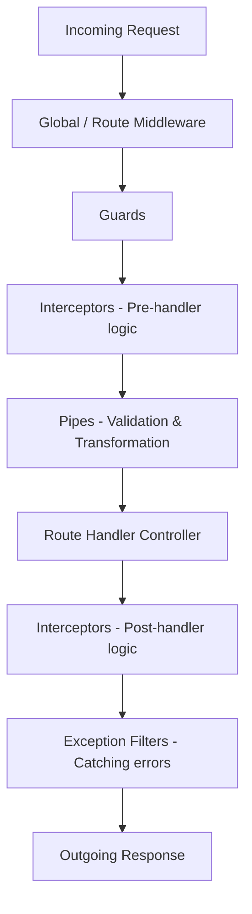

# NestJS & Enterprise Backend Development: Technical Interview Q&A Study Guide

This guide compiles essential technical questions and answers designed to prepare you for backend engineering interviews. The content is tailored to the technologies, architectures, and design patterns found in this codebase (**NestJS v11, TypeORM with PostgreSQL, Passport/JWT, Puppeteer PDF Generation, Nodemailer, and Domain-Driven design patterns**), as well as general production-grade backend concepts.

---

## 📂 Table of Contents
1. [NestJS Core Architecture & Request Lifecycle](#1-nestjs-core-architecture--request-lifecycle)
2. [Database Design, SQL & TypeORM (PostgreSQL)](#2-database-design-sql--typeorm-postgresql)
3. [Systems Engineering: Async Processing & Heavy Tasks](#3-systems-engineering-async-processing--heavy-tasks)
4. [Security, Authentication & Authorization](#4-security-authentication--authorization)
5. [Docker & Containerized Infrastructure](#5-docker--containerized-infrastructure)
6. [Testing, QA & System Architecture](#6-testing-qa--system-architecture)

---

## 1. NestJS Core Architecture & Request Lifecycle

### Q1.1: Describe the core architectural layers of NestJS. What is the difference between Controllers, Providers, and Modules?
* **Controllers** are responsible for handling incoming **HTTP requests** and returning **HTTP responses**. They define the routing endpoints (e.g., using `@Controller()`, `@Get()`, `@Post()`), parse input parameters, and delegate execution to the business logic layer.
* **Providers (Services)** house the core **business logic** and database queries of the application. Almost any class can be defined as a provider (services, repositories, factories, helpers) as long as it is decorated with `@Injectable()`. Providers are instantiated and managed by the NestJS Inversion of Control (IoC) container.
* **Modules** are classes decorated with `@Module()`. They establish the **organizational boundaries** of the application graph, grouping related controllers and providers into modular components. Every NestJS application has a root module (e.g., [app.module.ts](file:///Users/adedayo/Nest-Projects/invoice-builder-api/src/app.module.ts)) that imports other feature modules.

---

### Q1.2: How does Dependency Injection (DI) work in NestJS? What are provider scopes, and what are their performance trade-offs?
NestJS uses **constructor-based dependency injection** managed by its IoC container. When an class requests a provider in its constructor:
1. NestJS looks up the Injection Token representing the dependency.
2. It recursively resolves any dependencies of that dependency.
3. It instantiates the dependency (typically as a singleton) and injects it.

**Provider Scopes:**
NestJS supports three main instantiation scopes:
* **DEFAULT (Singleton)**: A **single instance** of the provider is created and shared across the entire application runtime. This is the **recommended** scope for most providers (e.g., [InvoicesService](file:///Users/adedayo/Nest-Projects/invoice-builder-api/src/invoices/invoices.service.ts)) because it minimizes memory footprint and garbage collection overhead.
* **REQUEST**: A **new instance** is created for *each incoming HTTP request*. It is garbage-collected immediately after the request finishes. It is useful for storing request-specific state (like multi-tenant databases based on headers) but incurs significant memory allocation and garbage collection overhead under high traffic.
* **TRANSIENT**: A **unique instance** is injected into *every class* that references it in its constructor. It is useful for classes that hold local state (like loggers custom-configured per-controller) but increases startup memory overhead.

---

### Q1.3: Explain the NestJS Request-Response Lifecycle. In what order do Guards, Interceptors, Pipes, and Exception Filters execute?
When an HTTP request hits a NestJS application, the request goes through a strict sequence of processing layers:



1. **Middleware**: Executes first. Best suited for logging, request parsing, or header manipulation.
2. **Guards**: Evaluate authorization logic (e.g., verifying roles or JWT tokens). If a guard returns `false`, execution halts immediately with `403 Forbidden` or `401 Unauthorized`.
3. **Interceptors (Pre-handler)**: Run right before the controller method. Can bind extra logic (e.g., measuring latency, caching).
4. **Pipes**: Used for data validation (using `class-validator`) and transformation (e.g., parsing integer route parameters).
5. **Route Handler (Controller)**: Executes the actual endpoint method.
6. **Interceptors (Post-handler)**: Transform the return value or catch response streams using RxJS operators.
7. **Exception Filters**: Capture unhandled exceptions thrown during request execution and format them into standardized JSON error responses.

---

## 2. Database Design, SQL & TypeORM (PostgreSQL)

### Q2.1: Why was PostgreSQL (a Relational DB) selected for the Invoice Builder API over NoSQL options like MongoDB?
An **Invoice Builder API** manages financial transactions, billing records, taxes, and customer entities. PostgreSQL was chosen because:
1. **ACID Transactions**: Financial operations (like processing payments and updating invoice status) require strict **Atomicity** (all operations succeed, or none do) and **Consistency** to prevent data discrepancies (e.g., marking an invoice as PAID without recording the payment).
2. **Referential Integrity**: Customers, invoices, and payments are highly connected. Enforcing foreign key constraints prevents orphan billing entries.
3. **Hybrid Data Capabilities**: PostgreSQL supports native **JSONB columns**, allowing us to store dynamic fields (like flexible item arrays, tax sub-objects, or discount parameters) without sacrificing relational constraints or database integrity.

---

### Q2.2: How do you configure a NestJS/TypeORM connection for a cloud PostgreSQL service like Neon that enforces SSL?
Neon and other cloud-native PostgreSQL databases require encrypted connections (SSL) in production.
In [app.module.ts](file:///Users/adedayo/Nest-Projects/invoice-builder-api/src/app.module.ts), TypeORM is configured as follows:
```typescript
TypeOrmModule.forRoot({
  type: 'postgres',
  host: process.env.DB_HOST,
  port: Number(process.env.DB_PORT),
  username: process.env.DB_USER,
  password: process.env.DB_PASS,
  database: process.env.DB_NAME,
  autoLoadEntities: true,
  synchronize: false, // Must be false in production!
  ssl: {
    rejectUnauthorized: false, // Bypasses self-signed certificate errors (required for Neon)
  },
})
```
> [!CAUTION]
> Setting `synchronize: true` in production can drop your database tables if TypeORM detects schema mismatches. Always use database migrations (`yarn typeorm migration:run`) to apply schema changes to staging and production databases.

---

### Q2.3: Explain how database transactions are managed in TypeORM. How is it implemented in this project for payments and refunds?
Transactions ensure that multiple database updates either execute completely or roll back entirely. In TypeORM, transactions are best managed using the `DataSource` instance via the callback pattern.

In [InvoicesService](file:///Users/adedayo/Nest-Projects/invoice-builder-api/src/invoices/invoices.service.ts), the `processPayment` method implements this:
```typescript
async processPayment(invoicePublicId: string, amount: number) {
  const result = await this.dataSource.transaction(async (manager) => {
    const invoiceRepo = manager.getRepository(Invoice);
    const paymentRepo = manager.getRepository(Payment);

    // 1. Fetch invoice within the transactional context
    const invoice = await invoiceRepo.findOne({
      where: { publicId: invoicePublicId },
      relations: ['payments'],
    });

    if (!invoice) throw new BadRequestException('Invoice not found');
    InvoiceDomain.assertCanModify(invoice);

    if (amount !== invoice.totalAmount) {
      throw new BadRequestException('Invalid payment amount');
    }

    // 2. Create the payment record inside the transaction
    const payment = paymentRepo.create({
      amount,
      status: 'success',
      type: 'payment',
      invoice,
    });
    await paymentRepo.save(payment);

    // 3. Update invoice status
    invoice.status = InvoiceStatus.PAID;
    InvoiceDomain.lock(invoice);
    await invoiceRepo.save(invoice);

    return { invoice, payment };
  });
  
  // Automation flows executed outside the transaction...
  return result;
}
```
If saving the payment fails or the invoice status update crashes, the transaction is automatically aborted, and any changes already written within the transaction block are rolled back.

---

### Q2.4: How do you prevent SQL Injection vulnerabilities when building queries in TypeORM?
SQL injection occurs when unvalidated user input is directly concatenated into a SQL statement, allowing attackers to execute unauthorized commands.

**TypeORM Protections:**
1. **Repository Methods**: Standard repository methods (like `findOne` or `find`) automatically use parameterized queries under the hood.
2. **QueryBuilder Parameter Binding**: When building dynamic queries (like in [InvoicesService.findAll](file:///Users/adedayo/Nest-Projects/invoice-builder-api/src/invoices/invoices.service.ts#L224)), input strings must **never** be concatenated. Parameter binding must be used:
   ```typescript
   // ❌ VULNERABLE: Direct concatenation (SQL Injection risk!)
   qb.andWhere(`customer.name ILIKE '%${query.search}%'`);

   // ✅ SECURE: Parameter binding (automatically sanitized by the driver)
   qb.andWhere(
     '(customer.name ILIKE :search OR invoice.publicId ILIKE :search)',
     { search: `%${query.search}%` },
   );
   ```

---

### Q2.5: Explain pagination, dynamic sorting, and validation in the GET endpoint context.
To prevent database exhaustion, endpoints returning list data must support pagination, search filters, and strict sort controls.
In [InvoicesService.findAll](file:///Users/adedayo/Nest-Projects/invoice-builder-api/src/invoices/invoices.service.ts#L224):
* **Pagination**: Done using `.skip((page - 1) * limit).take(limit)`. It limits the maximum result set size (e.g., capped at 50 results).
* **Sorting Whitelisting**: Users should not be allowed to sort by any arbitrary string, as it could lead to query crashes or slow database scans. Sorting fields must be whitelisted:
  ```typescript
  const allowedSortColumns = ['createdAt', 'totalAmount', 'status', 'dueDate'];
  const sortColumn = allowedSortColumns.includes(sortBy)
    ? `invoice.${sortBy}`
    : 'invoice.createdAt';
  
  qb.orderBy(sortColumn, order);
  ```

---

### Q2.6: What is Audit Logging, and how is it structured in this application?
Audit Logging tracks every modification made to database records, creating a secure paper trail.
In this application, [AuditService](file:///Users/adedayo/Nest-Projects/invoice-builder-api/src/audit/audit.service.ts) records the entity involved, the action type (`CREATE`, `UPDATE`, `STATUS_CHANGE`, `PAYMENT`, `REFUND`), the performing user, and the state of the entity before and after the modification:
```typescript
await this.auditService.log({
  entity: 'Invoice',
  entityId: invoice.id,
  action: 'STATUS_CHANGE',
  before: { status: invoice.status },
  after: { status: status },
});
```

---

## 3. Systems Engineering: Async Processing & Heavy Tasks

### Q3.1: In `processPayment`, why is PDF generation and emailing executed outside the database transaction?
Look at the implementation in [InvoicesService.processPayment](file:///Users/adedayo/Nest-Projects/invoice-builder-api/src/invoices/invoices.service.ts#L326-L348):
```typescript
const result = await this.dataSource.transaction(async (manager) => {
  // ... database updates ...
});

// ✅ AUTOMATION (OUTSIDE TRANSACTION BOUNDARY)
const fullInvoice = await this.invoiceRepo.findOne({ ... });
if (fullInvoice) {
  void (async () => {
    try {
      const pdf = await this.pdfService.generateInvoicePdf(fullInvoice);
      await this.mailService.sendInvoiceEmail(fullInvoice.customer.email, pdf);
    } catch (err) {
      console.error('Automation failed:', err);
    }
  })();
}
```
**Why this separation is critical:**
1. **Connection Pool Exhaustion**: Databases have a limited pool of active connections. Database transactions hold an open connection until they commit or roll back. Generating a PDF via Puppeteer (spawning a headless browser) and sending an email via Nodemailer (connecting to external SMTP servers) are slow network and CPU tasks. Running them *inside* the transaction would hold the DB connection open for seconds, quickly exhausting the connection pool and locking up the entire application.
2. **Third-Party Failures**: If the email server is temporarily down, the email delivery fails. If this happened inside the transaction, it would roll back the payment status update in the database, meaning the system would reject the customer's payment simply because an email couldn't be sent.

---

### Q3.2: What are the scaling limitations of using Puppeteer directly in `PdfService`? How would you solve this for high-traffic environments?
Currently, [PdfService](file:///Users/adedayo/Nest-Projects/invoice-builder-api/src/pdf/pdf.service.ts) launches a new headless browser instance for each PDF request:
```typescript
const browser = await puppeteer.launch({ headless: true });
// ... page load and PDF export ...
await browser.close();
```
**Scaling Limitations:**
* **CPU and Memory Spikes**: Spawning a Chrome browser instance requires significant RAM and CPU. If 20 users request invoices concurrently, the server will spawn 20 chrome processes, potentially leading to Out-Of-Memory (OOM) crashes.
* **Cold Starts**: Launching the browser on every request takes hundreds of milliseconds, adding response latency.

**Production Workarounds:**
1. **Browser Pooling**: Use a pool manager (e.g., `generic-pool`) to maintain 3-5 pre-warmed, running browser pages, reusing them instead of launching and destroying instances on each request.
2. **Background Queuing (BullMQ)**: Offload PDF requests to a background queue backed by Redis. The HTTP route returns `202 Accepted` immediately, and a worker pool processes PDF exports asynchronously.
3. **Dedicated microservice or serverless functions**: Extract the PDF generation engine into a separate container or run it on AWS Lambda, keeping CPU spikes isolated from the main API thread.

---

## 4. Security, Authentication & Authorization

### Q4.1: Explain stateless JWT authentication and how Passport-JWT handles token verification in this project.
JSON Web Tokens (JWT) allow stateless user authorization, meaning the server does not need to store active session IDs in database tables or memory stores.

**Lifecycle Flow:**
1. **Decoding & Verification**: The Passport strategy interceptor reads the token from the `Authorization: Bearer <token>` header.
2. **Signature Verification**: Passport validates the signature using the configured secret key. If valid, the payload is decoded.
3. **User Extraction**: In [JwtStrategy](file:///Users/adedayo/Nest-Projects/invoice-builder-api/src/auth/strategies/jwt.strategy.ts), we retrieve the user record to verify the account is active:
   ```typescript
   async validate(payload: JwtPayload) {
     const user = await this.usersService.findById(payload.sub);
     if (!user) throw new UnauthorizedException();
     return user; // Attached to the request object as `req.user`
   }
   ```

---

### Q4.2: How do you implement Role-Based Access Control (RBAC) dynamically in NestJS?
RBAC is implemented using a combination of **Custom Decorators** and **Guards**.

1. **Custom Roles Decorator**: Configured in [roles.decorator.ts](file:///Users/adedayo/Nest-Projects/invoice-builder-api/src/auth/decorators/roles.decorator.ts) to attach required roles metadata to routes:
   ```typescript
   export const Roles = (...roles: string[]) => SetMetadata('roles', roles);
   ```
2. **Roles Guard**: Configured in [roles.guard.ts](file:///Users/adedayo/Nest-Projects/invoice-builder-api/src/auth/guards/roles.guard.ts) to read route metadata using the `Reflector` service and compare it with the authenticated user:
   ```typescript
   @Injectable()
   export class RolesGuard implements CanActivate {
     constructor(private reflector: Reflector) {}

     canActivate(context: ExecutionContext): boolean {
       const requiredRoles = this.reflector.getAllAndOverride<string[]>('roles', [
         context.getHandler(),
         context.getClass(),
       ]);
       if (!requiredRoles) return true; // Route is public

       const request = context.switchToHttp().getRequest();
       const user = request.user;
       return requiredRoles.includes(user.role);
     }
   }
   ```

---

### Q4.3: Why should user passwords never be stored in plain text? How does bcrypt protect them?
Passwords must never be stored in plain text because a database leak would compromise all user accounts.

**Bcrypt protections:**
* **Salt**: A random sequence of bytes added to the password before hashing. This ensures two identical passwords generate completely different hashes, protecting against **Rainbow Table** lookups.
* **One-Way Function**: Hashing is mathematically irreversible. You can verify a password by hashing input and comparing it, but you cannot decrypt a hash back into plaintext.
* **Work Factor**: Bcrypt uses an adjustable CPU cost factor. Slowing down the hashing process (e.g., ~100ms per attempt) makes brute-force attacks computationally impractical.

---

### Q4.4: How are incoming requests validated in NestJS? Why use classes for DTOs instead of interfaces?
NestJS uses **Validation Pipes** built on top of `class-validator` and `class-transformer` to validate payloads before they reach controllers.

**The Interface vs. Class Paradox:**
> [!IMPORTANT]
> TypeScript interfaces are compile-time validation structures. During compilation, TypeScript undergoes **type erasure**, removing all interfaces entirely from the compiled JavaScript bundle. Classes, however, are native runtime Javascript constructors.
>
> By using **classes** for Data Transfer Objects (DTOs), NestJS can inspect the class decorators (like `@IsString()`, `@IsEmail()`, `@MinLength()`) at runtime, parsing and rejecting invalid input formats before hitting route logic.

---

## 5. Docker & Containerized Infrastructure

### Q5.1: Write a production-ready, multi-stage Dockerfile for this NestJS API. What makes it secure and lightweight?
Multi-stage Docker builds reduce the final image size by keeping compilation dependencies and build pipelines out of the runtime container.

Create a production `Dockerfile` in the project root:
```dockerfile
# --- Stage 1: Build Layer ---
FROM node:20-alpine AS builder

WORKDIR /app

# Copy package configurations first to leverage layer caching
COPY package.json yarn.lock ./

# Install devDependencies and dependencies
RUN yarn install --frozen-lockfile

# Copy the rest of the application code and build
COPY . .
RUN yarn build

# Remove development dependencies to prune the node_modules directory
RUN yarn install --production --frozen-lockfile --ignore-scripts --prefer-offline

# --- Stage 2: Runtime Runner Layer ---
FROM node:20-alpine AS runner

WORKDIR /app

# Set node environment to production
ENV NODE_ENV=production

# Copy only built distribution files and pruned node_modules
COPY --from=builder /app/dist ./dist
COPY --from=builder /app/node_modules ./node_modules
COPY --from=builder /app/package.json ./package.json

# Run container as a non-privileged system user for security
USER node

# Expose port and start the API
EXPOSE 3000
CMD ["node", "dist/main"]
```
**Key Optimization Points:**
* **`node:20-alpine`**: Alpine Linux is very small (~5MB base size), reducing the final image footprint.
* **Non-root Execution (`USER node`)**: Prevents attackers from gaining root privileges on the host OS in the event of an application container breach.
* **Dependency Separation**: Only production dependencies are copied to the runner stage, minimizing build bulk.

---

### Q5.2: Write a `docker-compose.yml` file to orchestrate the NestJS API and PostgreSQL locally.
This orchestrates the app and database containers, setting up local port forwarding, network bridges, and disk mount persistence:
```yaml
version: '3.8'

services:
  database:
    image: postgres:16-alpine
    container_name: invoice-builder-db
    restart: always
    environment:
      POSTGRES_DB: invoice_db
      POSTGRES_USER: api_user
      POSTGRES_PASSWORD: SecureDbPassword99
    ports:
      - "5432:5432"
    volumes:
      - postgres_data:/var/lib/postgresql/data
    networks:
      - backend-network

  api:
    build:
      context: .
      dockerfile: Dockerfile
    container_name: invoice-builder-api
    restart: always
    ports:
      - "3000:3000"
    environment:
      - PORT=3000
      - NODE_ENV=production
      - DB_HOST=database
      - DB_PORT=5432
      - DB_USER=api_user
      - DB_PASS=SecureDbPassword99
      - DB_NAME=invoice_db
    depends_on:
      - database
    networks:
      - backend-network

volumes:
  postgres_data:

networks:
  backend-network:
    driver: bridge
```
**Key Components:**
* **`depends_on`**: Ensures the PostgreSQL database container starts up before the API container launches.
* **`volumes`**: Mounts `postgres_data` onto the database's internal storage path, preserving database records when the container environment is stopped or rebuilt.
* **Dynamic Host Binding (`DB_HOST=database`)**: In the Docker bridge network, containers can refer to each other by their service name (`database`), abstracting out raw IP setups.

---

## 6. Testing, QA & System Architecture

### Q6.1: What is the difference between Unit Testing and Integration/E2E Testing in NestJS?
* **Unit Testing**: Verifies a single class or method (like [InvoicesService.create](file:///Users/adedayo/Nest-Projects/invoice-builder-api/src/invoices/invoices.service.ts#L71)) in complete isolation. Dependencies (like repositories, external mailers, or PDF engines) are mocked out completely.
  * *Tooling*: Jest is configured by default. We use `@nestjs/testing` modules with `createMocker` or custom mocks.
* **E2E (End-to-End) Testing**: Validates the entire flow from request inception to database side effects. E2E tests boot the complete NestJS application instance, hit REST endpoints via HTTP libraries (like `supertest`), and inspect real DB results.
  * *Tooling*: Found in the [test](file:///Users/adedayo/Nest-Projects/invoice-builder-api/test/) folder.

---

### Q6.2: How would you mock TypeORM repositories when writing unit tests for your services?
To mock the `@InjectRepository(Invoice)` provider, we can inject a mock repository shape containing standard methods (`find`, `findOne`, `create`, `save`):
```typescript
import { Test, TestingModule } from '@nestjs/testing';
import { getRepositoryToken } from '@nestjs/typeorm';
import { InvoicesService } from './invoices.service';
import { Invoice } from './entities/invoice.entity';

describe('InvoicesService', () => {
  let service: InvoicesService;
  let mockInvoiceRepo;

  beforeEach(async () => {
    mockInvoiceRepo = {
      findOne: jest.fn(),
      save: jest.fn(),
      create: jest.fn(),
    };

    const module: TestingModule = await Test.createTestingModule({
      providers: [
        InvoicesService,
        {
          provide: getRepositoryToken(Invoice),
          useValue: mockInvoiceRepo,
        },
      ],
    }).compile();

    service = module.get<InvoicesService>(InvoicesService);
  });

  it('should be defined', () => {
    expect(service).toBeDefined();
  });
});
```
This avoids establishing database connection handshakes during test suites, keeping unit testing fast and repeatable.
